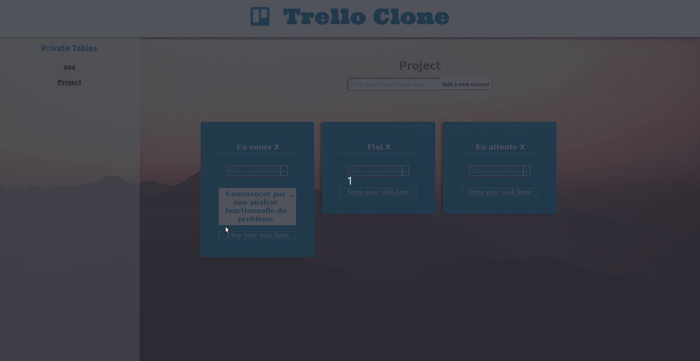

# Trello Clone

## Présentation:

Trello Clone, comme son nom l'indique est un clone de l'application web Trello, qui est un gestionnaire de projets, permettant à plusieurs individus de travailler sur un projet commun.  
Pour plus d'informations sur Trello, cliquez [ici](https://fr.wikipedia.org/wiki/Trello).  

Ce projet a été développé en Javascript/Elm pour la partie front et en Python/Flask pour la partie back.  

## Fonctionnalités:
 
- créer un compte, se connecter.
- créer des tables, les partager avec d'autres utilisateurs.

## Prérequis et Exécution

### Prérequis:

Pour pouvoir exécuter ce projet, il vous faut une version python 3.x que vous pouvez télécharger [ici](https://www.python.org/downloads/), ainsi que le framework flask.  
Un fichier `requirements.txt` est fourni, vous aurez simplement à le passer en paramètre de la commande `pip`.   
Vous aurez également besoin d'installer le langage [elm](https://guide.elm-lang.org/) sur votre machine.   

### Exécution:

+ Exécuter en local : `cd back` puis `python server.py`
+ Utiliser l'outil en ligne [glitch](https://amouhani-trello-clone.glitch.me/)  

### ENJOY !!!

